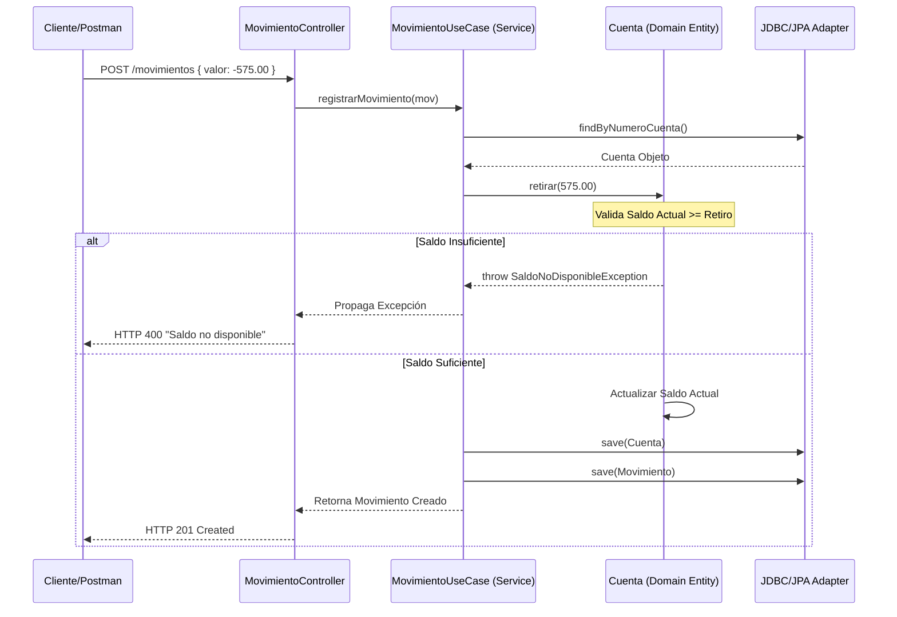
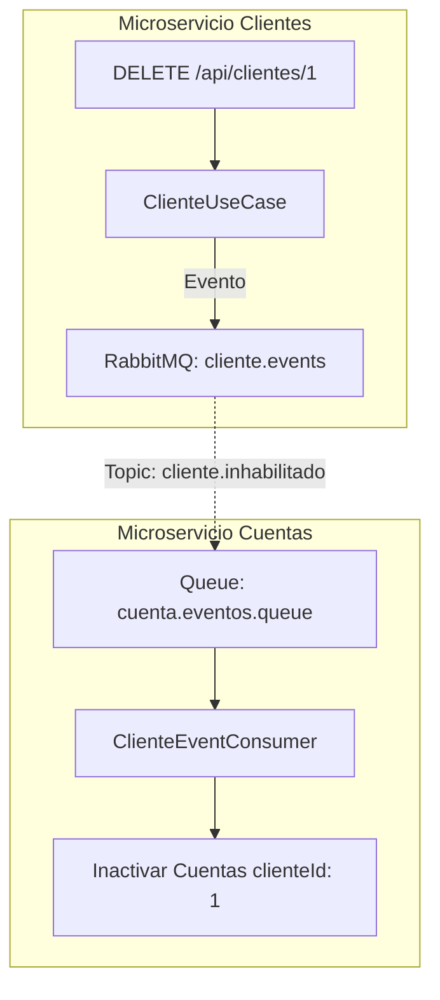

# 📚 Sistema Financiero Distribuido - Proyecto Devsu

Este proyecto implementa un sistema financiero robusto basado en microservicios, diseñado bajo los principios de **Arquitectura Hexagonal (Clean Architecture)**, comunicación asincrónica y alta cobertura de pruebas técnicas.

---

## 🚀 1. Guía de Inicio Rápido (5 Minutos)

Para levantar el entorno completo (Infraestructura + Microservicios) de forma automática:

```bash
# 1. Clonar y entrar al proyecto
git clone <url>
cd devsu-test

# 2. Levantar todo el stack con Docker (Construye imágenes y arranca servicios)
docker-compose up -d --build

# 3. Verificar que los contenedores estén corriendo
docker-compose ps
```

---

## 🏗️ 2. Arquitectura del Sistema

El sistema se compone de dos microservicios desacoplados que interactúan mediante **RabbitMQ** para garantizar la consistencia eventual.

| Microservicio | Puerto | Base de Datos | Responsabilidad |
|---------------|--------|---------------|-----------------|
| **ms-clientes** | `8001` | `db_clientes` | CRUD de Personas y Clientes. Emite eventos de inhabilitación. |
| **ms-cuentas** | `8002` | `db_cuentas` | Gestión de Cuentas, Movimientos y Reportes Financieros. |

### Estratificación de Capas (Hexagonal)
Cada microservicio sigue estrictamente el aislamiento de capas:
*   **`domain`**: Entidades puras (POJOs), excepciones de negocio y puertos (interfaces de repositorios). **Cero dependencias de framework.**
*   **`application`**: Casos de uso y orquestación (Servicios). Maneja la lógica de flujo sin detalles técnicos.
*   **`infrastructure`**: Adaptadores JPA, Controladores REST, Consumidores RabbitMQ y configuraciones de Spring Boot.

---

## 📈 3. Casos de Uso y Flujos (Muestra Gráfica)

### A. Registro de Movimiento y Validación de Saldo (F2/F3)
Este flujo orquestado en `ms-cuentas` asegura que el saldo de la cuenta sea validado en el **Dominio** antes de persistirse.



### B. Comunicación Asincrónica (FInhabilitar Cliente)
Cuando un cliente es eliminado o inactivado en `ms-clientes`, se propaga un evento para bloquear sus cuentas.



---

## 🧪 4. Estrategia y Ejecución de Pruebas

### Pruebas Unitarias (F5)
*   **Implementación**: `CuentaBalanceTest.java` en `ms-cuentas`.
*   **Cobertura**: Validaciones de saldo, depósitos, retiros y excepciones personalizadas.
*   **Ejecución**:
    ```bash
    cd ms-cuentas
    mvn test
    ```

### Pruebas de Integración (F6)
*   **Implementación**: `ClienteIntegrationTest.java` en `ms-clientes`.
*   **Tecnología**: **Testcontainers** (PostgreSQL real) + **MockMvc**.
*   **Cobertura**: Creación de clientes, persistencia real y manejo de conflictos (duplicados).
*   **Ejecución**:
    ```bash
    cd ms-clientes
    mvn test
    ```

---

## 🐋 5. Despliegue y Contenedores (F7)

Se han implementado **Dockerfiles Multistage** optimizados para reducir el tamaño de la imagen final y mejorar la seguridad:
1.  **Stage builder**: Compila el código usando Maven 3.8.
2.  **Stage jre**: Ejecuta el JAR corregido en un entorno ligero JRE Alpine.
3.  **Seguridad**: Ejecución con usuario no-root (`devsu`).

### Orquestación de Red
```
┌─ Host (Tu Máquina) ────────┐    ┌─ Docker Internal Network ──┐
│  8001 (ms-clientes)  ──────┼───>│  ms-clientes:8080         │
│  8002 (ms-cuentas)   ──────┼───>│  ms-cuentas:8080          │
│  15672 (Rabbit UI)  ───────┼───>│  rabbitmq:15672           │
│  5433 (Postgres Ext) ──────┼───>│  postgres:5432            │
└────────────────────────────┘    └───────────────────────────┘
```

---

## 📋 6. Datos de Prueba Iniciales (Casos de Uso)

El archivo `[BaseDatos.sql](./BaseDatos.sql)` inicializa el sistema con:

| Cliente | Cédula | Cuenta | Tipo | Saldo Inicial |
|---------|--------|--------|------|---------------|
| **Jose Lema** | 1712345678 | 478758 | Ahorros | 2000.00 |
| **Marianela Montalvo** | 1722345678 | 225487 | Corriente | 100.00 |
| **Juan Osorio** | 1732345678 | 495878 | Ahorros | 0.00 |
| **Marianela Montalvo** | 1722345678 | 496825 | Ahorros | 540.00 |
| **Jose Lema** | 1712345678 | 585545 | Corriente | 1000.00 |

---

## 🛠️ 7. Guía de Operación y Soporte

### Acceder a los Microservicios (REST)
*   **Clientes**: `http://localhost:8001/api/clientes`
*   **Cuentas**: `http://localhost:8002/cuentas`
*   **Movimientos**: `http://localhost:8002/movimientos`
*   **Reportes**: `http://localhost:8002/reportes?fecha=2022-01-01,2022-12-31&cliente=1`

### Administración de Infraestructura
*   **RabbitMQ Management**: `http://localhost:15672` (guest / guest).
*   **Base de Datos CLI**: 
    ```bash
    docker-compose exec postgres psql -U postgres -d db_cuentas
    ```

### Troubleshooting Rápido
*   **Error 409 Conflict**: Identificación duplicada en clientes.
*   **Error 400 "Saldo no disponible"**: Retiro excede el saldo actual (Validación F3).
*   **Logs**: `docker-compose logs -f [servicio]`

---
**Última Actualización:** 2026-03-17  
**Estado:** Requerimientos F1 a F7 Completados ✅
