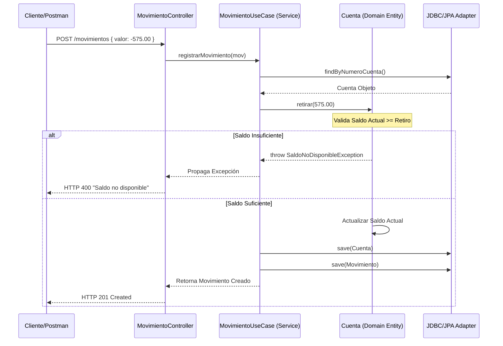
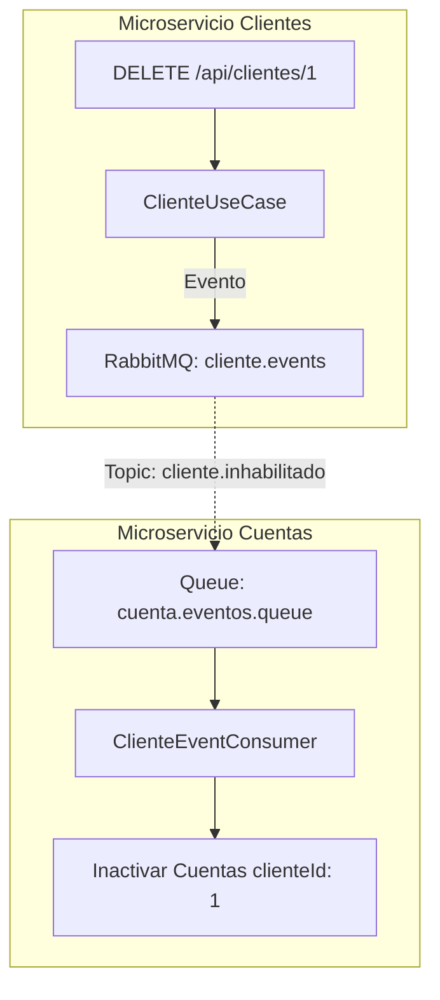

# 📚 Sistema Financiero Distribuido - Proyecto Devsu

Este proyecto implementa un sistema financiero robusto basado en microservicios, diseñado bajo los principios de **Arquitectura Hexagonal (Clean Architecture)**, comunicación asincrónica y alta cobertura de pruebas técnicas.

---

## 🚀 1. Guía de Inicio Rápido (5 Minutos)

Para levantar el entorno completo (Infraestructura + Microservicios) de forma automática:

```bash
# 1. Clonar y entrar al proyecto
git clone <url>
cd devsu-test

# 2. Levantar todo el stack con Docker (Construye imágenes y arranca servicios)
docker-compose up -d --build

# 3. Verificar que los contenedores estén corriendo
docker-compose ps

# 4. Acceder a RabbitMQ Management
# http://localhost:15672  (guest / guest)

# 5. Acceder a Grafana (Dashboards)
# http://localhost:3000 (admin / admin)

# Dashboards grafana:
# http://localhost:3000/d/spring_boot_21/spring-boot-3-x-statistics?orgId=1&from=now-1h&to=now&timezone=browser&var-application=&var-Namespace=&var-instance=ms-clientes:8080&var-hikaricp=HikariPool-1&var-memory_pool_heap=$__all&var-memory_pool_nonheap=$__all

# 6. Acceder a Prometheus (Metrics)
# http://localhost:9090 (admin / admin)

# 7. Acceder a Swagger (Documentation)
# http://localhost:8001/swagger-ui.html
# http://localhost:8002/swagger-ui.html

# 8. Acceder a ms-clientes
# http://localhost:8001/api/clientes
# http://localhost:8001/api/clientes/{id}

# 9. Acceder a ms-cuentas
# http://localhost:8002/movimientos
# http://localhost:8002/reportes

# 10. Base de datos postgresql
# http://localhost:5433 (postgres/postgres) db_clientes y db_cuentas

### Para lanzar las pruebas de postmant puedes usar el archivo collection.json que se encuentra en la carpeta endpoints-para-pruebas-postman
```
### 💡 Importante: Datos de Prueba
El sistema se inicializa automáticamente con:
- **3 Clientes**: Jose Lema (1001), Marianela Montalvo (1002), Juan Osorio (1003).
- **5 Cuentas**: Diversas cuentas de ahorro y corriente para los clientes listados.
- **Movimientos Iniciales**: Se incluyen movimientos de ejemplo para validar los reportes de inmediato.
- **Passwords**: Todos los clientes tienen contraseñas de al menos 8 caracteres (ej: `12345678`) para cumplir con las validaciones de dominio.
---

## 🏗️ 2. Arquitectura del Sistema

El sistema se compone de dos microservicios desacoplados que interactúan mediante **RabbitMQ** para garantizar la consistencia eventual.

| Microservicio | Puerto Externo | Puerto Interno | Base de Datos | Responsabilidad |
|---------------|----------------|----------------|---------------|-----------------|
| **ms-clientes** | `8001`        | `8080`         | `db_clientes` | CRUD de Personas y Clientes. Emite eventos de inhabilitación. |
| **ms-cuentas**  | `8002`        | `8080`         | `db_cuentas`  | Gestión de Cuentas, Movimientos y Reportes Financieros. |


### Stack Tecnológico
- **Java 17+** con Spring Boot  3.x
- **PostgreSQL 16** (Alpine) para persistencia
- **RabbitMQ 3.13** (Management Plugin) para eventos asincronos
- **Docker & Docker Compose** (V2 recomendado) para orquestación
- **JUnit 5, Mockito, Testcontainers** para pruebas
- **Lombok** para reducción de boilerplate, utilidades

---

### Estratificación de Capas (Hexagonal)
Cada microservicio sigue estrictamente el aislamiento de capas:
*   **`domain`**: Entidades puras (POJOs), excepciones de negocio y puertos (interfaces de repositorios). **Cero dependencias de framework.**
*   **`application`**: Casos de uso y orquestación (Servicios). Maneja la lógica de flujo sin detalles técnicos.
*   **`infrastructure`**: Adaptadores JPA, Controladores REST, Consumidores RabbitMQ y configuraciones de Spring Boot.

---

## 📈 3. Casos de Uso y Flujos (Muestra Gráfica)

### A. Registro de Movimiento y Validación de Saldo (F2/F3)
Este flujo orquestado en `ms-cuentas` asegura que el saldo de la cuenta sea validado en el **Dominio** antes de persistirse.



### B. Comunicación Asincrónica (FInhabilitar Cliente)
Cuando un cliente es eliminado o inactivado en `ms-clientes`, se propaga un evento para bloquear sus cuentas.


### Clientes (`ms-clientes`)
- **Listar todos**: `GET http://localhost:8001/api/clientes`
- **Obtener uno**: `GET http://localhost:8001/api/clientes/{id}`

### Cuentas y Movimientos (`ms-cuentas`)
- **Movimientos**: `POST http://localhost:8002/movimientos` (Valida saldo F3)
- **Reporte consolidado (F4)**: 
  `GET http://localhost:8002/reportes?fecha=YYYY-MM-DD,YYYY-MM-DD&cliente={id}`
  *Ejemplo:* `http://localhost:8002/reportes?fecha=2022-01-01,2025-12-31&cliente=1001`
---

## 🧪 4. Estrategia y Ejecución de Pruebas

### Pruebas Unitarias de Dominio (F5)
Ubicadas en `ms-cuentas`, validan la lógica de saldos sin tocar la base de datos.
    ```bash
    cd ms-cuentas
    mvn test
    ```

### Pruebas de Integración (F6)
Ubicadas en `ms-clientes`, prueban el flujo completo desde el Controller hasta la base de datos real.
    ```bash
    cd ms-clientes
    mvn test
    ```

---

## 🐋 5. Infraestructura, Docker, Despliegue y Contenedores (F7)

Se han implementado **Dockerfiles Multistage** optimizados para reducir el tamaño de la imagen final y mejorar la seguridad:
1.  **Stage builder**: Compila el código usando Maven 3.8.
2.  **Stage jre**: Ejecuta el JAR corregido en un entorno ligero JRE Alpine.
3.  **Seguridad**: Ejecución con usuario no-root (`devsu`).

### Red y Conectividad
Ambos microservicios están configurados para correr en el puerto **8080** internamente, facilitando la estandarización en contenedores. 
Para acceso externo, se mapean los puertos `8001` y `8002`.

### Persistencia
- **`BaseDatos.sql`**: Contiene el DDL y DML (Inserts) que se ejecutan al primer arranque.
- **`scripts/init-db.sql`**: Script encargado de crear las bases de datos `db_clientes` y `db_cuentas` antes de que los servicios intenten conectar.

---

### Orquestación de Red
```
┌─ Host (Tu Máquina) ────────┐    ┌─ Docker Internal Network ───────┐
│  8001 (ms-clientes)  ──────┼───>│  ms-clientes:8080 (interno)     │
│  8002 (ms-cuentas)   ──────┼───>│  ms-cuentas:8080  (interno)     │
│  15672 (Rabbit UI)  ───────┼───>│  rabbitmq:15672 (Message Broker)│
│  5433 (Postgres Ext) ──────┼───>│  postgres:5432 (BD)             │
└────────────────────────────┘    └─────────────────────────────────┘
```
---

## 📋 Scripts de Inicialización

### `scripts/init-db.sql`
Crea las bases de datos y usuarios en PostgreSQL:
- `db_clientes` (para ms-clientes)
- `db_cuentas` (para ms-cuentas)
- Usuarios específicos con permisos limitados

### `scripts/rabbitmq-definitions.json`
Pre-configura RabbitMQ con:
- Exchanges: `cliente.events`, `cuenta.events`
- Queues: `cliente.eventos.queue`, `cuenta.eventos.queue`
- Bindings y usuarios

**Más detalles:** Ver [scripts/README.md](scripts/README.md)

---

## 📁 Estructura del Proyecto

```
devsu-test/
│
├── scripts/                      # 🔧 Scripts de Inicialización
│   ├── init-db.sql              # Inicialización PostgreSQL
│   ├── rabbitmq-definitions.json # Configuración RabbitMQ
│   └── README.md                 # Documentación de scripts
│
├── ms-clientes/                  # 🎭 Microservicio 1 
│   ├── src/main/java/com/devsu/clientes/
│   │   ├── domain/               # Lógica de negocio pura
│   │   ├── application/          # Casos de uso
│   │   └── infrastructure/       # Adaptadores técnicos
│   ├── src/test/java/...         # Tests
│   └── pom.xml
│
├── ms-cuentas/                   # 💰 Microservicio 2 
│   ├── src/main/java/com/devsu/cuentas/
│   │   ├── domain/               # Lógica de negocio pura
│   │   ├── application/          # Casos de uso
│   │   └── infrastructure/       # Adaptadores técnicos
│   ├── src/test/java/...         # Tests
│   └── pom.xml
│
├── docker-compose.yml            # 🐋 Orquestación Docker
├── .env.example                  # 🔐 Variables de entorno (template)
├── .gitignore                    # Git ignore (archivos sensibles)
└── README.md                     # Este archivo
```
---
## 🏛️ Clean Architecture (Hexagonal) - Estructura Real

Cada microservicio implementa su propia jerarquía de capas independiente:

```text
ms-xxxxx/ (ms-clientes | ms-cuentas)
├── src/main/java/com/devsu/xxxxx/
│   ├── domain/                          # 1. CORE: Negocio Pura
│   │   ├── entity/                      # Entidades (Sin Frameworks)
│   │   ├── exception/                   # Excepciones 
│   │   └── port/                        # Interfaces de Salida (Repos)
│   │
│   ├── application/                     # 2. CASOS DE USO: Orquestación
│   │   ├── port/in/                     # Interfaces de Entrada (API)
│   │   ├── service/                     # Lógica de Servicios
│   │   └── dto/                         # DTOs 
│   │
│   └── infrastructure/                  # 3. INFRAESTRUCTURA: Adaptadores
│       ├── adapters/
│       │   ├── in/
│       │   │   ├── web/                 # Controllers & Exception Handler
│       │   │   └── event/               # RabbitMQ Consumers
│       │   └── out/
│       │       └── persistence/         # JPA, Entity, Repo, Mappers
│       └── config/                      # Spring Beans & MQ Config
│
└── src/test/java/com/devsu/xxxxx/       # 🧪 CONTEXTO DE PRUEBAS
    ├── domain/                          # 🟢 Unit Tests 
    └── infrastructure/                  # 🔵 Integration Tests 
```
---

## 📋 6. Datos de Prueba Iniciales (Casos de Uso)

## 🧪 Estrategia de Pruebas

### Pruebas Unitarias
- ✅ Entidades de dominio
- ✅ Casos de uso (services)
- ✅ Value objects
- **Tool:** JUnit 5 + Mockito

### Pruebas de Integración
- ✅ Controllers REST
- ✅ Repositories
- ✅ Consumers de eventos
- **Tool:** @SpringBootTest + Testcontainers

## 🌉 Ejemplo: Comunicación Asincrónica

### Cliente es Eliminado en ms-clientes

```
1. DELETE /api/clientes/{id}
   ↓
2. ms-clientes elimina cliente de BD
   ↓
3. ms-clientes PUBLICA "ClienteInhabilitadoEvent"
   ↓
4. Evento va a RabbitMQ (exchange: cliente.events)
   ↓
5. ms-cuentas CONSUME evento
   ↓
6. ms-cuentas busca cuentas del cliente
   ↓
7. ms-cuentas marca cuentas como INACTIVAS
```

> **🚀 Flow Recomendado:** Este es el patrón implementado en los microservicios


El archivo `[BaseDatos.sql](./BaseDatos.sql)` inicializa el sistema con:

| Cliente | Cédula | Cuenta | Tipo | Saldo Inicial |
|---------|--------|--------|------|---------------|
| **Jose Lema** | 1712345678 | 478758 | Ahorros | 2000.00 |
| **Marianela Montalvo** | 1722345678 | 225487 | Corriente | 100.00 |
| **Juan Osorio** | 1732345678 | 495878 | Ahorros | 0.00 |
| **Marianela Montalvo** | 1722345678 | 496825 | Ahorros | 540.00 |
| **Jose Lema** | 1712345678 | 585545 | Corriente | 1000.00 |

---

## 🛠️ 7. Guía de Operación y Soporte

### Acceder a los Microservicios (REST)
*   **Clientes**: `http://localhost:8001/api/clientes`
*   **Cuentas**: `http://localhost:8002/cuentas`
*   **Movimientos**: `http://localhost:8002/movimientos`
*   **Reportes**: `http://localhost:8002/reportes?fecha=2022-01-01,2022-12-31&cliente=1`

### Administración de Infraestructura
*   **RabbitMQ Management**: `http://localhost:15672` (guest / guest).
*   **Base de Datos CLI**: 
    ```bash
    docker-compose exec postgres psql -U postgres -d db_cuentas
    ```

### 🐛Troubleshooting Rápido

| Problema | Causa Común | Solución |
|----------|-------------|----------|
| **Error 400 en POST Clientes** | Password corta | El dominio exige min 8 caracteres. |
| **Error de parseo en Reporte** | Formato de fecha | Usar `YYYY-MM-DD`. Ejemplo: `2022-01-01`. |
| **Bases de datos vacías** | Fallo en init | Borrar volúmenes: `docker-compose down -v` y reiniciar. |
| **Contenedor Healthy pero sin red** | Mapeo de puerto | Los servicios internos usan 8080; se exponen en 8001/8002. |

---

*   **Error 409 Conflict**: Identificación duplicada en clientes.
*   **Error 400 "Saldo no disponible"**: Retiro excede el saldo actual (Validación F3).


## 🐛 Debugging y Monitoreo

### Logs en Tiempo Real
```bash
docker-compose logs -f [servicio]            # Todos
docker-compose logs -f ms-postgres  # Solo PostgreSQL
docker-compose logs -f ms-rabbitmq  # Solo RabbitMQ
```


### 🛠️ Depuración en VS Code (Debug Mode)

Para depurar los microservicios localmente utilizando la infraestructura (Bases de Datos y RabbitMQ) que corre en Docker:

1.  **Prepación de Infraestructura:**
    Asegúrese de que solo la base de datos y RabbitMQ estén corriendo. Si levantó todo con `docker-compose up`, detenga solo los microservicios para evitar conflictos de puertos:
    ```bash
    docker-compose stop ms-clientes ms-cuentas
    ```

2.  **Configuración de `launch.json`:**
    Cree o verifique el archivo `.vscode/launch.json` con la siguiente configuración:

    ```json
    {
        "version": "0.2.0",
        "configurations": [
            {
                "type": "java",
                "name": "Debug ms-clientes (Local)",
                "request": "launch",
                "mainClass": "com.devsu.clientes.MsClientesApplication",
                "projectName": "ms-clientes",
                "env": {
                    "SPRING_DATASOURCE_URL": "jdbc:postgresql://localhost:5433/db_clientes",
                    "SPRING_RABBITMQ_HOST": "localhost",
                    "SERVER_PORT": "8001"
                }
            },
            {
                "type": "java",
                "name": "Debug ms-cuentas (Local)",
                "request": "launch",
                "mainClass": "com.devsu.cuentas.MsCuentasApplication",
                "projectName": "ms-cuentas",
                "env": {
                    "SPRING_DATASOURCE_URL": "jdbc:postgresql://localhost:5433/db_cuentas",
                    "SPRING_RABBITMQ_HOST": "localhost",
                    "SERVER_PORT": "8002"
                }
            }
        ],
        "compounds": [
            {
                "name": "Debug Ambos Servicios",
                "configurations": [
                    "Debug ms-clientes (Local)",
                    "Debug ms-cuentas (Local)"
                ]
            }
        ]
    }
    ```

3.  **Iniciar Depuración:**
    - Abra la vista **Run and Debug** en VS Code (`Ctrl+Shift+D`).
    - Seleccione **"Debug Ambos Servicios"** y presione `F5`.
    - Esto permite depurar ambos microservicios simultáneamente, permitiendo trazabilidad completa entre ellos.


### Acceder a Bases de Datos
```bash
# PostgreSQL CLI
docker-compose exec ms-postgres psql -U postgres -d db_clientes

# Ver tablas
\dt
\l   # listar bases de datos
```

### RabbitMQ Management
```
URL: http://localhost:15672
Usuario: guest
Contraseña: guest
```

---

## ✅ Checklist Antes de Empezar

- [ ] Docker y Docker Compose instalados
- [ ] Java 17+ instalado
- [ ] Maven o Gradle instalado
- [ ] `docker-compose up -d` ejecutado exitosamente
- [ ] `docker-compose ps` muestra todos los servicios UP
- [ ] PostgreSQL accesible en puerto 5432
- [ ] RabbitMQ Management accesible en http://localhost:15672
- [ ] `.env.example` copiado a `.env` (opcional para desarrollo)

---

## 📚 Documentación del Proyecto

- **Scripts:** [scripts/README.md](scripts/README.md)
- **Docker:** `docker-compose.yml`
- **Configuración:** `.env.example`

---
---

## 📞 Troubleshooting Rápido

| Problema | Solución |
|----------|----------|
| Port 5432 en uso | `lsof -i :5432` → `kill -9 <PID>` |
| Port 5672 en uso | `lsof -i :5672` → `kill -9 <PID>` |
| Docker no inicia | Reiniciar Docker Desktop |
| Datos corruptos | `docker-compose down -v` |
| No ve cambios | Reconstruir: `docker-compose up -d --build` |

---

## 🎓 Referencias Externas

- 📖 [Spring Boot Docs](https://spring.io/projects/spring-boot)
- 🐘 [PostgreSQL Docs](https://www.postgresql.org/docs/)
- 🐰 [RabbitMQ Docs](https://www.rabbitmq.com/documentation.html)
- 🏗️ [Clean Architecture](https://blog.cleancoder.com/uncle-bob/2012/08/13/the-clean-architecture.html)
- 🧪 [JUnit 5 Guide](https://junit.org/junit5/docs/current/user-guide/)

---

## 🔭 8. Observabilidad Avanzada (Trazabilidad y Métricas)

El ecosistema cuenta con un stack de observabilidad completo (Micrometer Tracing, Zipkin, Prometheus y Grafana) implementado para producción:

### Trazabilidad Distribuida (Zipkin)
- Cada petición (HTTP o AMQP) generará automáticamente un `traceId` y `spanId`.
- La inyección de metadatos cruza la barrera asincrónica de **RabbitMQ** permitiendo ver gráficamente en Zipkin todo el flujo transaccional.
- **Acceso:** `http://localhost:9411`

### Métricas y Monitorización (Prometheus & Grafana)
- Las métricas internas de la JVM (Heap, Open Files, CPU) de cada microservicio se recolectan automáticamente a través de los endpoints `/actuator/prometheus`.
- **Grafana (Dashboards):** `http://localhost:3000` (admin/admin).
- **Auto-Provisioning:** El sistema inicializa automáticamente el *Data Source* de Prometheus y provee un Dashboard por defecto (Spring Boot 3 Statistics) listo para usar sin configuración manual.

---